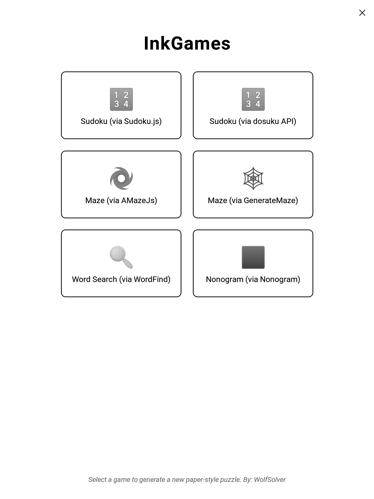
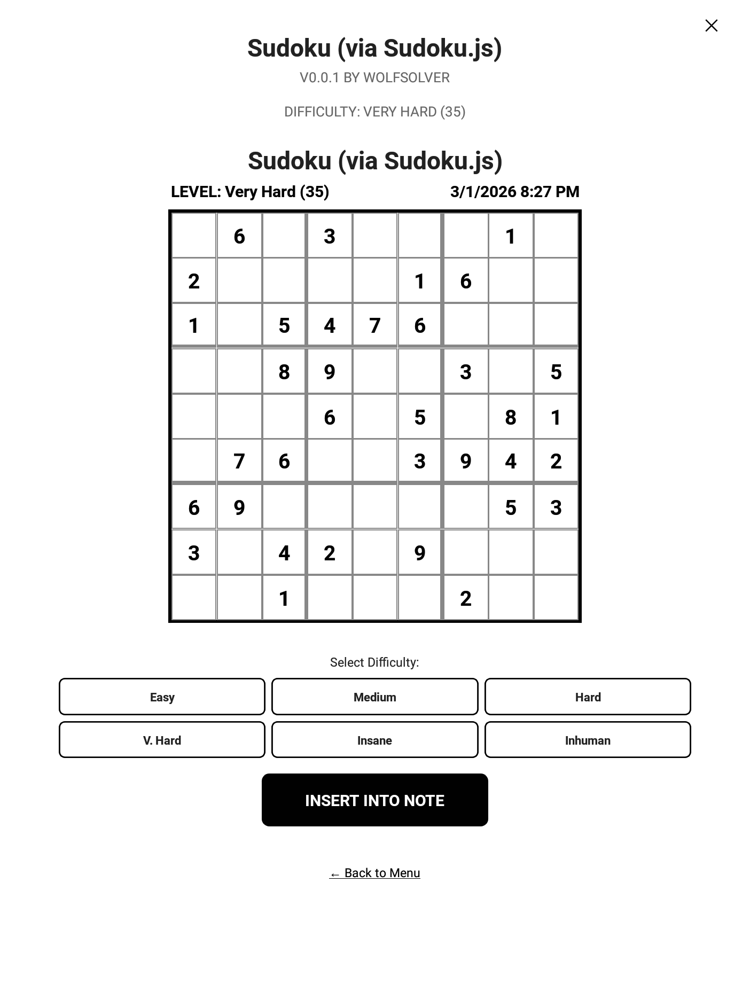

# 🖋️ InkGames for Supernote

> *"No UI clutter—just you, your pen, and your logic."*

[!INFO]
> **Supernote** is a next-generation E-Ink device designed to provide a natural, distraction-free writing experience, blending the tactile feel of traditional paper with the digital versatility of an Android-based tablet. For more info, visit [supernote.com](https://supernote.com).

**InkGames** is a minimalist, mainly offline **puzzle generator** designed specifically for Supernote E-ink devices. It is **not an interactive gaming app** in the traditional sense; instead, it acts as a digital printing house for your device.

The goal of this project is to generate high-quality, paper-style puzzle grids that you can "insert" into your notes and solve manually using your Supernote stylus. It bridges the gap between digital convenience and the tactile satisfaction of a physical puzzle book.

## 🚀 Download & Install
You can find the latest stable version of the plugin as a `.snplg` file on the **[Releases Page](https://github.com/wolfsolver/Supernote_InkGames/releases/latest)**.

---

## 🧠 Philosophy: Manual Solving
*   **Generator, Not Player**: The app creates the challenge (Sudoku, Maze, etc.) but does not "manage" the gameplay. No timers, no auto-checks, no "fill-in" buttons.
*   **Stylus-First**: Once a puzzle is generated, you insert it into a Note and solve it exactly as you would on paper—with your pen and your logic.

## 📸 Screenshots

| Main Menu | Game Configuration | Puzzle in Note |
|:---:|:---:|:---:|
|  |  |  |

## ✨ Key Features

* **Insert into Note**: Every puzzle can be instantly captured and inserted as an image into your current note.
* **Paper-Like Experience**: Optimized for E-ink displays with high-contrast layouts and no distracting animations.
* **100% Offline**: Allmost all game engines run locally on the device—no internet required. (except Sudoku online)
* **Stylus-First Design**: Large touch targets and spacious grids designed for comfortable handwriting.
* **Customizable**: Enable or disable specific game engines directly from the settings menu.

## 🎮 Included Games & Engines

The app supports a modular engine-based approach defined in the configuration:

* 🔢 **Sudoku**: Infinite grids via `Sudoku.JS` (powered by [sudoku.js](https://github.com/robatron/sudoku.js)).
* 🔢 **Sudoku**: Infinite grids via `Dosuku` (powered by [SudokuApi](https://github.com/Marcus0086/SudokuApi/)).
* 🌀 **Mazes**: Procedurally generated labyrinths using `AMazeJs` (using [amaze](https://github.com/erniehs-zz/amaze)). You need to start from top left to bottom right.
* 🌀 **Mazes**: Procedurally generated labyrinths using `GenerateMaze` (using [mazes](https://github.com/codebox/mazes)).
* 🔍 **Word Search**: Find hidden words from common dictionaries using `WordFind`.
* ⬛ **Nonograms**: Logical picture puzzles optimized for digital ink.

## 🛠️ Technical Stack

* **Framework**: React Native (Supernote Plugin SDK).
* **Language**: TypeScript.
